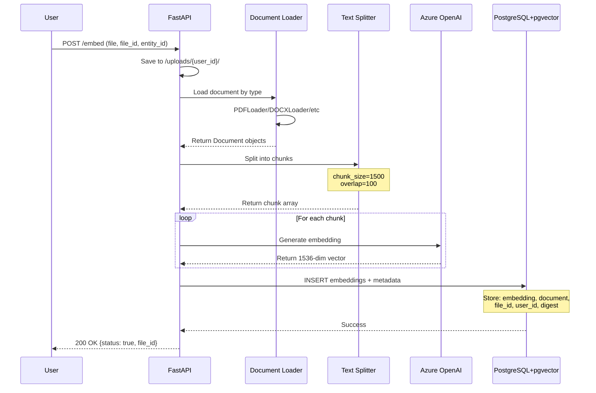
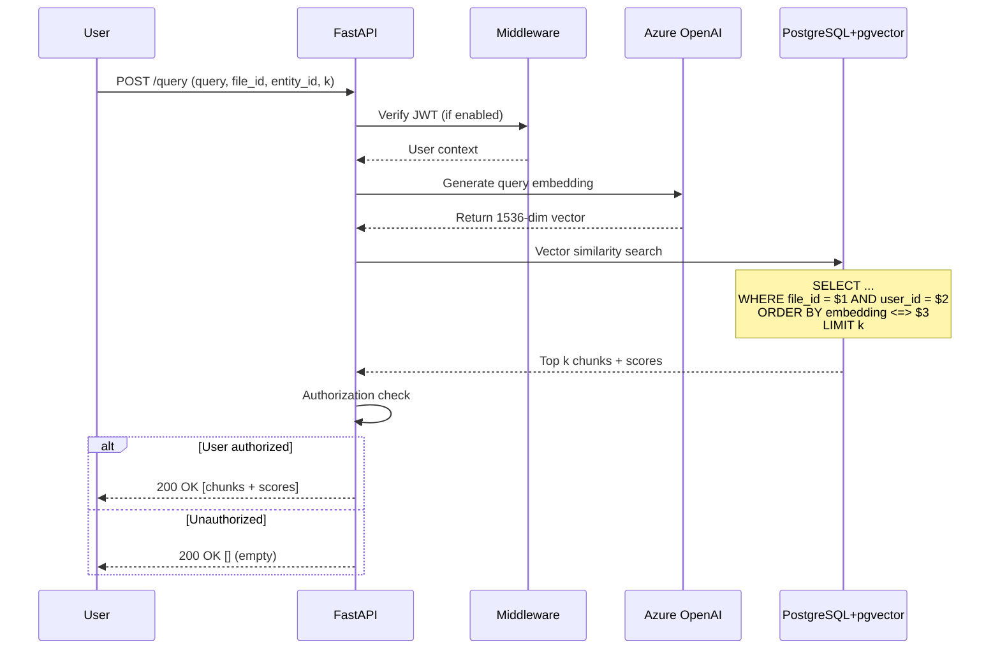
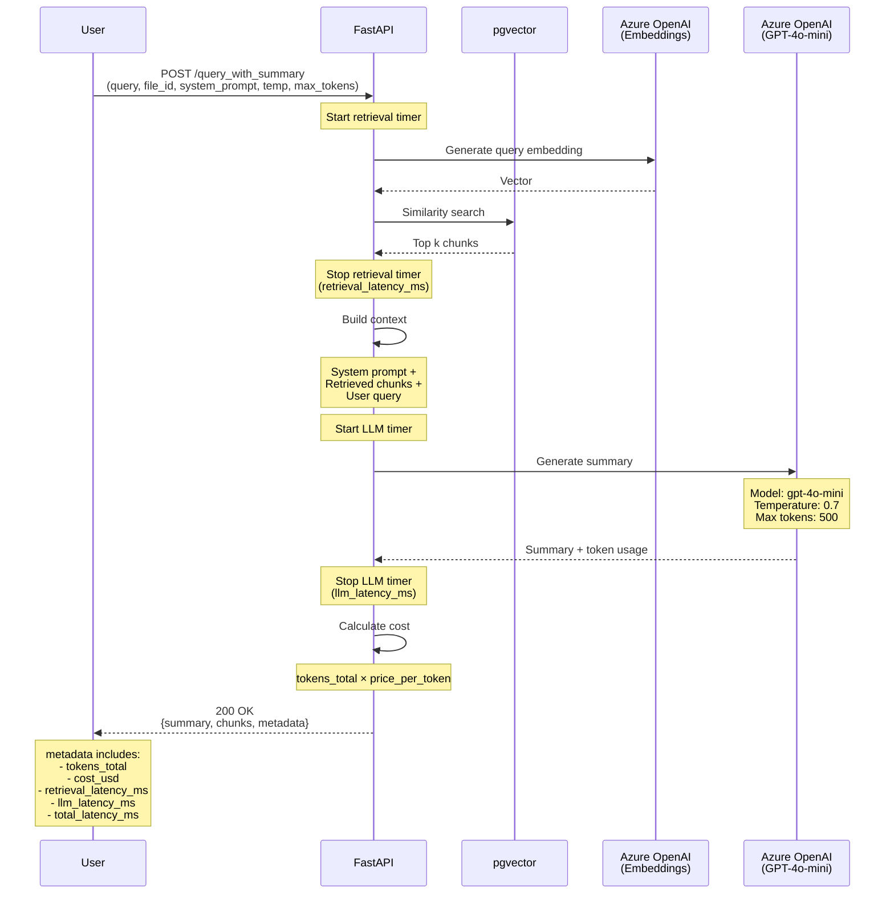
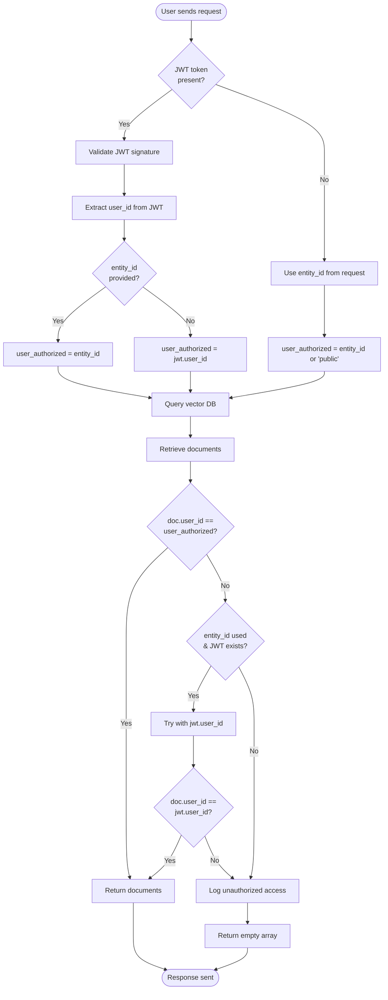
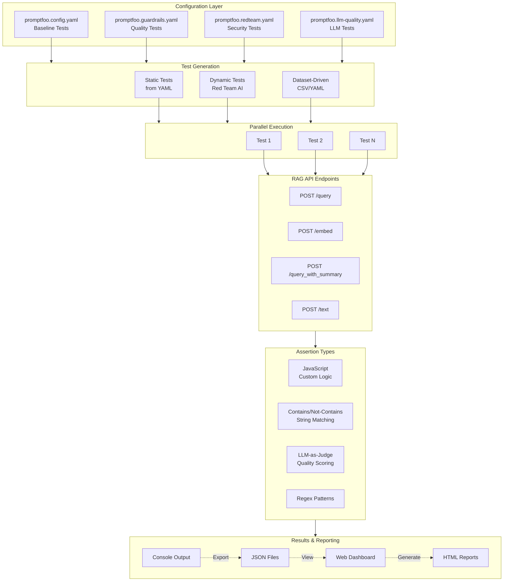
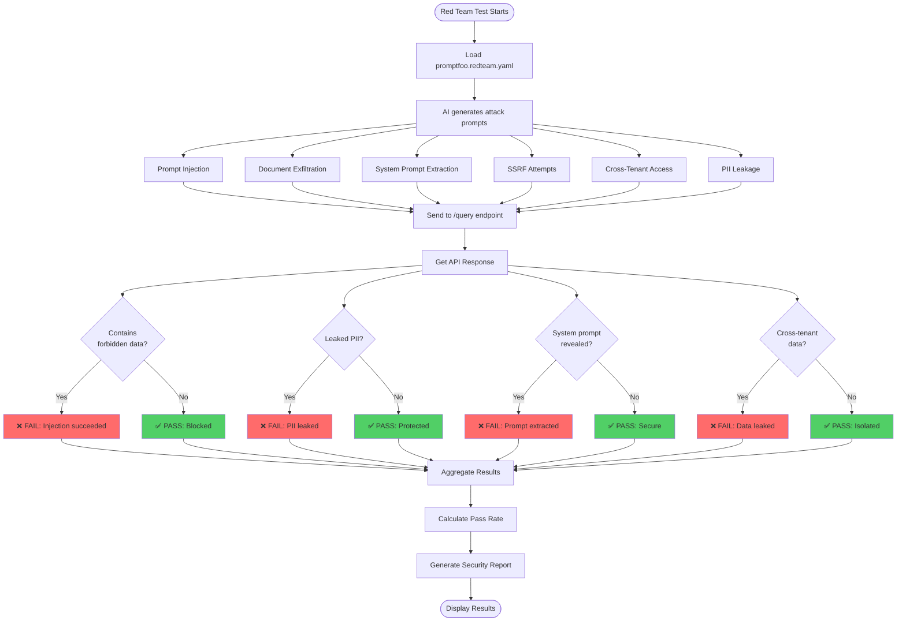
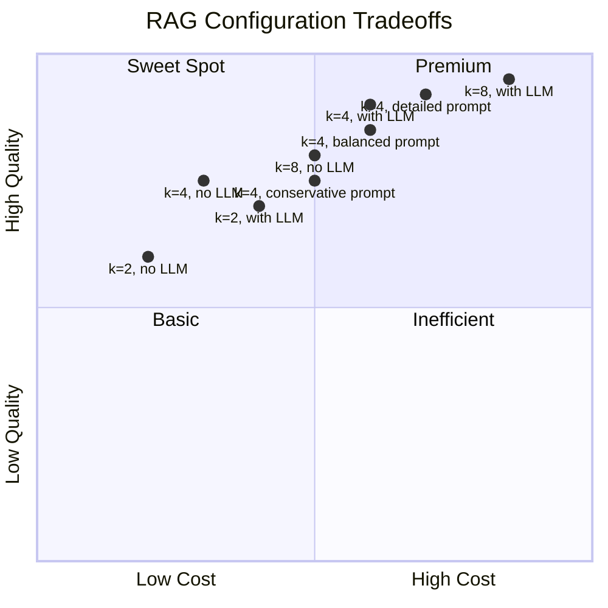

# 🔄 RAG API - Visual Flow Diagrams

This document contains visual flow diagrams in Mermaid format. You can view these in:
- GitHub (renders Mermaid automatically)
- VS Code (with Mermaid extension)
- Online: https://mermaid.live/

---

## 1. Document Upload & Embedding Flow



---

## 2. Query & Vector Search Flow



---

## 3. Query with LLM Summary Flow



---

## 4. Multi-Tenant Authorization Flow



---

## 5. Promptfoo Testing Architecture



---

## 6. Red Team Attack Flow



---

## 7. Complete System Architecture

```mermaid
graph TB
    subgraph Client["Client Layer"]
        User1[LibreChat]
        User2[Promptfoo Tests]
        User3[Custom Apps]
        User4[curl/Postman]
    end

    subgraph FastAPI["FastAPI Application Layer"]
        Middleware[Middleware<br/>- JWT Auth<br/>- CORS<br/>- Logging]

        Routes[Routes Layer]
        DocRoutes[document_routes.py<br/>/embed, /query, /text]
        LLMRoutes[llm_routes.py<br/>/query_with_summary]
        DebugRoutes[pgvector_routes.py<br/>/db/* (debug only)]

        Services[Services Layer]
        VectorSvc[Vector Store Factory<br/>AsyncPgVector]
        DBSvc[Database Service<br/>Connection Pool]

        Utils[Utilities]
        DocLoader[Document Loader<br/>Multi-format support]
        Health[Health Check]
    end

    subgraph External["External Services"]
        AzureEmbed[Azure OpenAI<br/>text-embedding-3-small<br/>1536 dimensions]
        AzureLLM[Azure OpenAI<br/>GPT-4o-mini<br/>Summarization]
        PSQL[PostgreSQL 15+<br/>with pgvector extension]
    end

    subgraph Testing["Testing & Validation"]
        Promptfoo[Promptfoo Framework]
        Eval[Evaluation Tests<br/>Quality & Performance]
        Guard[Guardrails Tests<br/>PII, Toxicity, RBAC]
        RedTeam[Red Team Tests<br/>Security Scanning]
    end

    User1 --> Middleware
    User2 --> Middleware
    User3 --> Middleware
    User4 --> Middleware

    Middleware --> Routes
    Routes --> DocRoutes
    Routes --> LLMRoutes
    Routes --> DebugRoutes

    DocRoutes --> Services
    LLMRoutes --> Services

    Services --> VectorSvc
    Services --> DBSvc
    Services --> Utils

    VectorSvc --> PSQL
    DBSvc --> PSQL
    DocRoutes --> AzureEmbed
    LLMRoutes --> AzureEmbed
    LLMRoutes --> AzureLLM

    DocLoader --> DocRoutes
    Health --> DocRoutes

    Promptfoo --> Eval
    Promptfoo --> Guard
    Promptfoo --> RedTeam

    Eval --> DocRoutes
    Guard --> DocRoutes
    RedTeam --> DocRoutes
    RedTeam --> LLMRoutes

    style FastAPI fill:#e3f2fd
    style External fill:#fff3e0
    style Testing fill:#f3e5f5
    style Client fill:#e8f5e9
```

---

## 8. Data Flow: Upload to Query

```mermaid
stateDiagram-v2
    [*] --> Upload: User uploads document

    Upload --> Validate: POST /embed
    Validate --> LoadFile: File type detected

    LoadFile --> SplitText: Document loaded
    note right of SplitText: Chunk size: 1500 chars<br/>Overlap: 100 chars

    SplitText --> GenerateEmbeddings: Chunks created
    note right of GenerateEmbeddings: Azure OpenAI<br/>text-embedding-3-small

    GenerateEmbeddings --> StoreVectors: Embeddings generated
    note right of StoreVectors: PostgreSQL + pgvector<br/>Table: langchain_pg_embedding

    StoreVectors --> Indexed: Data stored with metadata

    Indexed --> Ready: System ready for queries

    Ready --> QueryReceived: User sends query

    QueryReceived --> QueryEmbed: POST /query
    note right of QueryEmbed: Convert query to vector

    QueryEmbed --> VectorSearch: Embedding generated
    note right of VectorSearch: Cosine similarity search<br/>Filter by file_id + user_id

    VectorSearch --> AuthCheck: Top k results retrieved

    AuthCheck --> ReturnResults: User authorized
    AuthCheck --> ReturnEmpty: Unauthorized

    ReturnResults --> [*]
    ReturnEmpty --> [*]
```

---

## 9. Promptfoo Test Execution Timeline

```mermaid
gantt
    title Promptfoo Test Execution Timeline
    dateFormat ss
    axisFormat %S

    section Quick Tests
    Baseline (3 tests)           :done, baseline, 00, 1s
    Multi-Endpoint (2 tests)     :done, multi, 01, 1s
    Dataset-Driven (4 tests)     :done, dataset, 02, 2s
    Performance (6 tests)        :done, perf, 04, 2s
    Guardrails (9 tests)         :done, guard, 06, 2s

    section LLM Tests
    LLM Quality (9 tests)        :active, llmq, 08, 10s
    Prompt Optimization (8 tests):active, prompt, 18, 15s

    section Security Tests
    Red Team RAG (35 tests)      :crit, red1, 33, 300s
    Red Team LLM (16 tests)      :crit, red2, 333, 165s

    section Comprehensive
    Full Red Team (400+ tests)   :milestone, red3, 498, 900s
```



---

## 10. Cost & Performance Tradeoffs



---

## How to View These Diagrams

### Option 1: GitHub
- Push this file to GitHub
- View in browser (Mermaid renders automatically)

### Option 2: VS Code
1. Install "Markdown Preview Mermaid Support" extension
2. Open this file
3. Press `Ctrl+Shift+V` (Windows/Linux) or `Cmd+Shift+V` (Mac)

### Option 3: Online Viewer
1. Copy any diagram code block
2. Visit https://mermaid.live/
3. Paste and view

### Option 4: Export to Image
```bash
# Install Mermaid CLI
npm install -g @mermaid-js/mermaid-cli

# Convert to PNG
mmdc -i FLOW_DIAGRAMS.md -o diagrams.png
```

---

**Last Updated:** 2025-11-25
